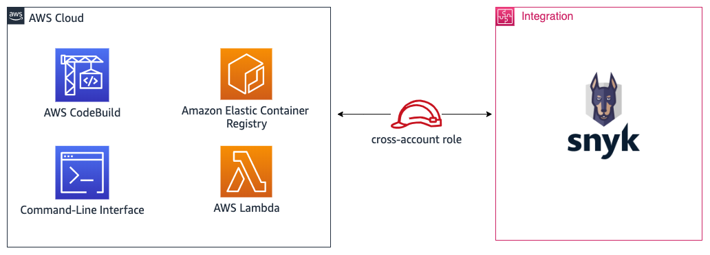

# quickstart-snyk-security
## Snyk: Developer-First Security on the AWS Cloud

Snyk finds and fixes vulnerabilities in applications that use open source, serverless and containers. Snyk's seamless integration into the developer workflow, with continuous monitoring of applications in production, empowers developers to continue to release fast, while ensuring secure code.

This Quick Start establishes cross-account access and enables Snyk integrations 
to the following AWS services:
* [AWS CodeBuild](https://aws.amazon.com/codebuild/)
* [Amazon Elastic Container Registry (ECR)](https://aws.amazon.com/ecr/)
* [AWS Lambda](https://aws.amazon.com/lambda/)

In order to deploy this Quick Start, you will need a valid Snyk account. You can 
[sign up for a free account](https://snyk.io/signup/) or subscribe through the 
[AWS Marketplace](https://aws.amazon.com/marketplace/saas/ordering?productId=36811992-19af-484d-9598-40c2b324a8d6&ref_=saas_pdp_header_continue). It is recommended that you visit the 
[Snyk Knowledge Center](https://support.snyk.io/hc/en-us) for additional information on the integrations.

