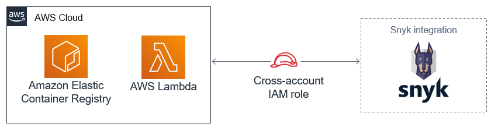
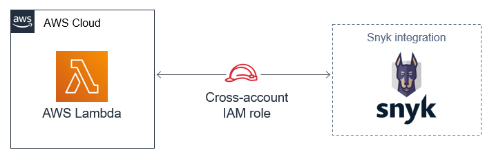
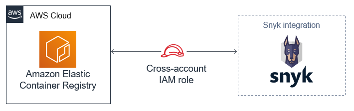

# Snyk: Developer-First Security on the AWS Cloud

**NOTE** - This Quick Start is intended to be used as a submodule for Snyk integration in other Quick Start deployments, however it can be used as a standalone deployment within your AWS account.

## Overview

Snyk finds and fixes vulnerabilities in applications that use open source, serverless and containers. Snyk's seamless integration into the developer workflow, with continuous monitoring of applications in production, empowers developers to continue to release fast, while ensuring secure code.

> Please know that we may share who uses AWS Quick Starts with the AWS Partner Network (APN) Partner that collaborated 
> with AWS on the content of the Quick Start.

## Architecture

This Quick Start establishes cross-account access and enables Snyk integrations with AWS Lambda and Amazon Elastic Container Registry.

*Figure 1: Quick Start architecture for Snyk full integration*

As shown in Figure 1, the Quick Start for Snyk full integration sets up the following:
* One cross-account role for integration with AWS Lambda.
* One cross-account role for integration with Amazon Elastic Container Registry.

*Figure 2: Quick Start architecture for Snyk integration with AWS Lambda*

As shown in Figure 2, the Quick Start for Snyk integration with AWS Lambda sets up the following:
* One cross-account role for integration with AWS Lambda.

*Figure 3: Quick Start architecture for Snyk integration with Amazon Elastic Container Registry*

As shown in Figure 3, the Quick Start for Snyk integration with Amazon Elastic Container Registry sets up the following:
* One cross-account role for integration with Amazon Elastic Container Registry.

## Cost and licenses

You are responsible for the cost of the AWS services used while running this Quick Start reference deployment. 
There is no additional cost for using the Quick Start.

The AWS CloudFormation template for this Quick Start includes configuration parameters that you can customize. 
Some of these settings may affect the cost of deployment. For cost estimates, see the pricing pages for each AWS 
service you will use. Prices are subject to change.

> Tip: We recommend that you enable the AWS Cost and Usage Report. This report delivers billing metrics to an Amazon 
> Simple Storage Service (Amazon S3) bucket in your account. It provides cost estimates based on usage throughout each 
> month and finalizes the data at the end of the month. For more information about the report, see the AWS 
> documentation.

In order to deploy this Quick Start, you will need a valid Snyk account. You can 
[sign up for a free account](https://snyk.io/signup/) or subscribe through the 
[AWS Marketplace](https://aws.amazon.com/marketplace/saas/ordering?productId=36811992-19af-484d-9598-40c2b324a8d6&ref_=saas_pdp_header_continue).

## Deployment options

This Quick Start provides three deployment options:
* Deploy Snyk full integration. This option builds two cross-account roles for integration with AWS Lambda and Amazon Elastic Container Registry.
* Deploy Snyk integration for AWS Lambda. This option builds one cross-account role for integration with AWS Lambda.
* Deploy Snyk integration for Amazon Elastic Container Registry. This option builds one cross-account role for integration with Amazon Elastic Container Registry.

## Send us feedback

To post feedback, submit feature ideas, or report bugs, use the 
[Issues](https://github.com/aws-quickstart/quickstart-eks-snyk/issues) section of the GitHub repository for this Quick 
Start. If you’d like to submit code, please review the Quick Start Contributor’s Guide.

## Additional resources

### AWS resources

* [Getting Started Resource Center](https://aws.amazon.com/getting-started/)
* [AWS General Reference](https://docs.aws.amazon.com/general/latest/gr/)
* [AWS Glossary](https://docs.aws.amazon.com/general/latest/gr/glos-chap.html)

### AWS services

* [AWS CloudFormation](https://docs.aws.amazon.com/cloudformation/)
* [IAM](https://docs.aws.amazon.com/iam/)
* [Amazon Elastic Container Registry (ECR)](https://aws.amazon.com/ecr/)
* [AWS Lambda](https://aws.amazon.com/lambda/)

### Snyk documentation

* [Snyk Knowledge Center](https://support.snyk.io/hc/en-us)

### Other Quick Start reference deployments

* [AWS Container Quick Start home page](https://aws.amazon.com/quickstart/?quickstart-all.sort-by=item.additionalFields.updateDate&quickstart-all.sort-order=desc&awsf.quickstart-homepage-filter=categories%23containers)
* [AWS Quick Start home page](https://aws.amazon.com/quickstart/)