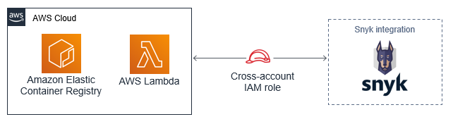
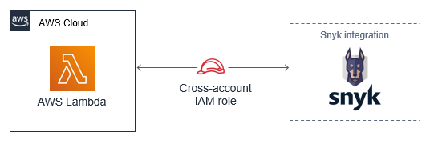

This Quick Start establishes cross-account access and enables {partner-product-short-name} integrations with AWS Lambda
and Amazon Elastic Container Registry.

// Replace this example diagram with your own. Send us your source PowerPoint file. Be sure to follow our guidelines here : http://(we should include these points on our contributors giude)
:xrefstyle: short
[#architecture1]
.Quick Start architecture for {partner-product-short-name} full integration on AWS

As shown in <<architecture1>>, the Quick Start for {partner-product-short-name} full integration sets up the following:

* One cross-account role for integration with AWS Lambda.
* One cross-account role for integration with Amazon Elastic Container Registry.

[#architecture2]
.Quick Start architecture for {partner-product-short-name} with AWS Lambda

As shown in <<architecture2>>, the Quick Start for {partner-product-short-name} with AWS Lambda sets up the following:

* One cross-account role for integration with AWS Lambda.

[#architecture3]
.Quick Start architecture for {partner-product-short-name} with Amazon Elastic Container Registry
image::../images/quickstart-snyk-security-ecr.png[ECR Architecture,width=100%,height=100%]

As shown in <<architecture3>>, the Quick Start for {partner-product-short-name} with Amazon Elastic Container Registry sets up the following:

* One cross-account role for integration with Amazon Elastic Container Registry.

// Add bullet points for any additional components that are included in the deployment. Make sure that the additional components are also represented in the architecture diagram. End each bullet with a period.
// * <describe any additional components>.

// [.small]#*The template that deploys the Quick Start into an existing VPC skips the components marked by asterisks and prompts you for your existing VPC configuration.#
