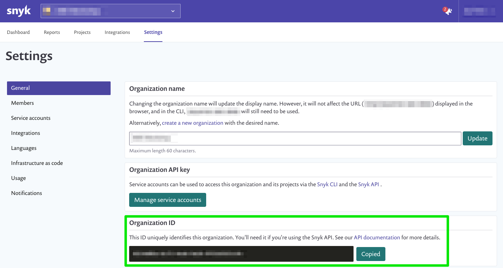

// If no preperation is required, remove all content from here

==== Prepare your AWS account

This Quick Start assumes that you already have Amazon ECR repositories and/or Lambda functions provisioned in your account.

==== Prepare your {partner-company-name} account
:xrefstyle: short
[#settings1]

As shown in the <<settings1>>, log in to your https://app.snyk.io/[Snyk account] and obtain your *Organization ID*.

// ==== Prepare for the deployment

// _Describe any preparation required to complete the product build, such as obtaining licenses or placing files in S3_