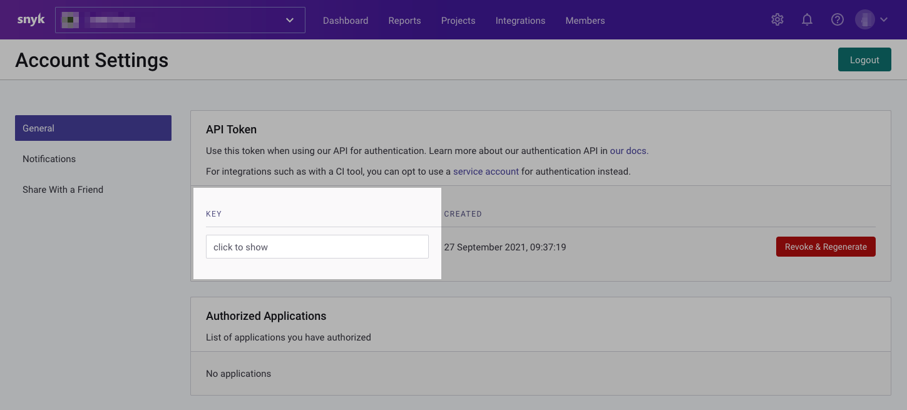
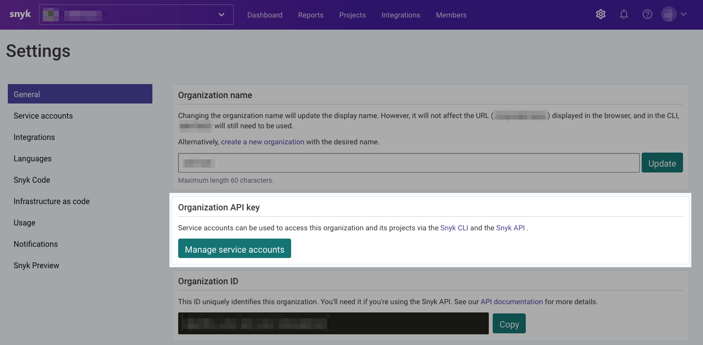

// If no preperation is required, remove all content from here

==== Prepare your AWS account

This Quick Start assumes that you already have Amazon ECR repositories and/or Lambda functions provisioned in your account.

==== Prepare your {partner-company-name} account
:xrefstyle: short
[#settings1]
.Snyk Settings page
image::../images/snyk_org_id_settings.png[Snyk Organization ID,width=100%,height=100%]

Regardless of which quickstart option you choose, log in to your https://app.snyk.io/[Snyk Account], as shown in <<settings1>>, and obtain your Organization ID.

If you are deploying Snyk Security with full integration or solely for Amazon ECR, obtain an API authentication token. This token is used to automate the creation of ECR integrations within Snyk.

You may use either your personal account token, available via your Snyk account's settings page as shown in <<settings2>>,
or a Service account token.
Service account tokens may be created via the Settings page for your Organization within Snyk as shown in <<settings3>>. For more information regarding Snyk service accounts, visit https://docs.snyk.io/features/integrations/managing-integrations/service-accounts[docs.snyk.io].

:NOTE: Automated configuration of ECR integrations with Snyk require a paid Snyk subscription.

[#settings2]
.Snyk Account settings page

[#settings3]
.Snyk organization service account settings

==== Snyk Account Access

The Snyk AWS Account is required to assume a role in your account in order to function. Please be aware that this deployment grants Snyk the ability to assume an IAM role in your account. 
In order to continue, please use `198361731867` as the account ID for the *Snyk AWS Account ID* parameter
