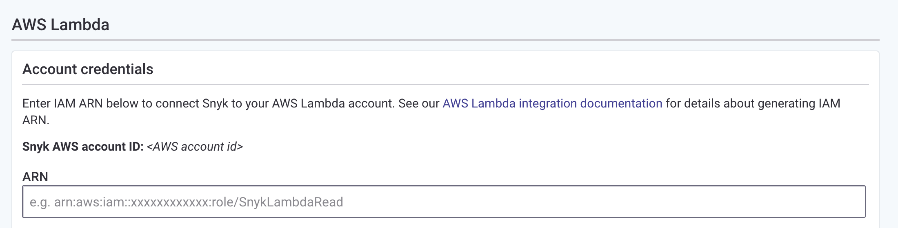

// If no preperation is required, remove all content from here

==== Prepare your AWS account

This Quick Start assumes that you already have Amazon ECR repositories and/or Lambda functions provisioned in your account.

==== Prepare your {partner-company-name} account
:xrefstyle: short
[#settings1]
.Snyk Settings page
image::../images/snyk_org_id_settings.png[Snyk Organization ID,width=100%,height=100%]

As shown in the <<settings1>>, log in to your https://app.snyk.io/[Snyk account] and obtain your Organization ID.

==== Snyk Account Access

The Snyk AWS Account is required to assume a role in your account in order to function. Please be aware that this deployment grants Snyk the ability to assume an IAM role in your account.
In order to continue, please use the *Snyk AWS Account ID* specified on the Snyk website when setting up the AWS lambda integration (Integrations -> AWS Lambda).
[#settings2]
.Snyk AWS Account ID
